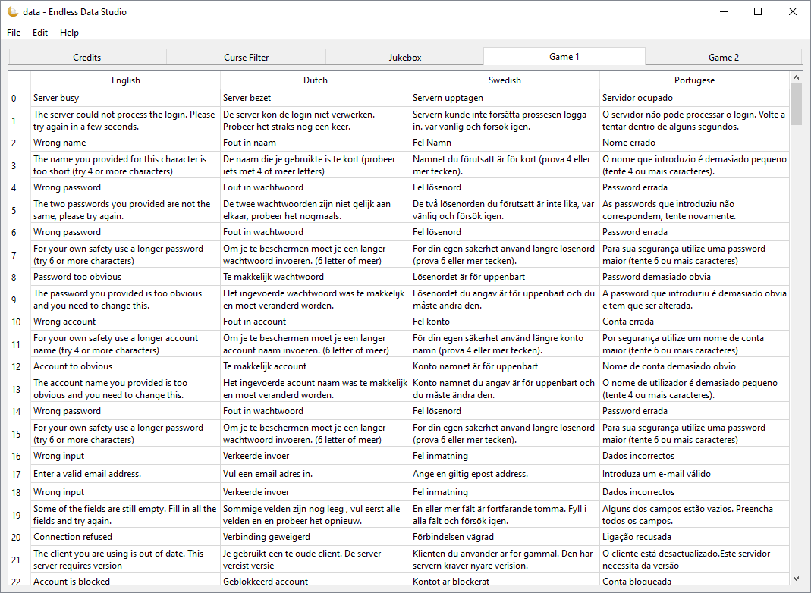

A tool for creating and modifying the EDF data files from Endless Online.

## Screenshots

## Development

### Requirements

- [Python](https://www.python.org/downloads/) 3.10+
- [Hatch](https://hatch.pypa.io/latest/install/)

### Available Commands

| Command                     | Description                                            |
| --------------------------- | ------------------------------------------------------ |
| `hatch build`               | Build package                                          |
| `hatch clean`               | Remove build artifacts                                 |
| `hatch run lint:format`     | Format source files using `black`                      |
| `hatch run lint:style`      | Check formatting using `black`                         |
| `hatch run lint:typing`     | Check typing using `mypy`                              |
| `hatch run lint:all`        | Check formatting using `black` and typing using `mypy` |
| `hatch run release:prepare` | Prepare and tag a new release                          |
| `hatch run release:deploy`  | Build and deploy the application                       |
